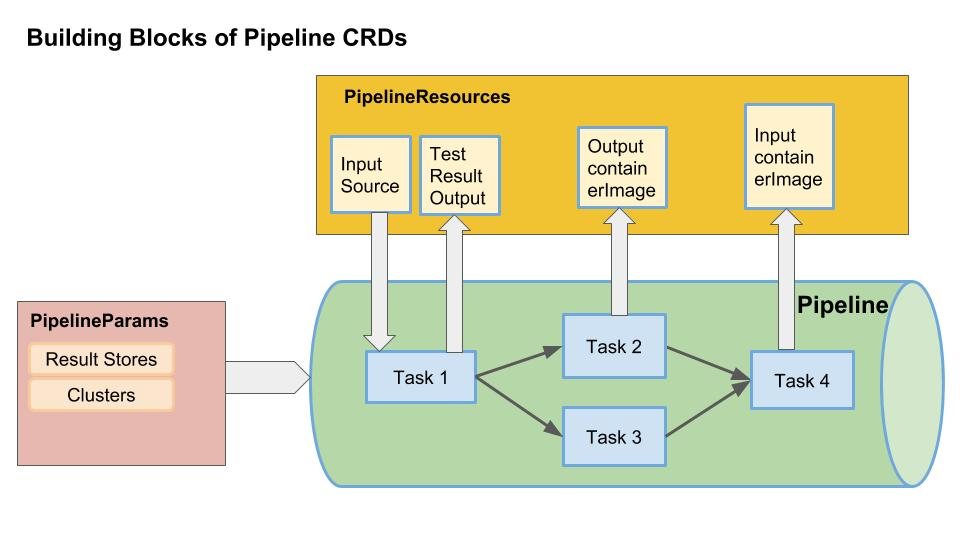

# Pipeline CRDs
Pipeline CRDs is an open source implementation to configure and run CI/CD style pipelines for your kubernetes application.
Pipeline CRDs creates [Custom Resources](https://kubernetes.io/docs/concepts/extend-kubernetes/api-extension/custom-resources/) as building blocks to declare pipelines. 

A resource is an endpoint in the Kubernetes API that stores a collection of API objects of a certain kind. For example, the built-in pods resource contains a collection of Pod objects.
A custom resource is an extension of Kubernetes API which can create a custom [Kubernetest Object](https://kubernetes.io/docs/concepts/overview/working-with-objects/kubernetes-objects/#understanding-kubernetes-objects).
Once a custom resource is installed, users can create and access its objects with kubectl, just as they do for built-in resources like pods.

# Building Blocks of Pipeline CRDs
The building blocks of Pipeline CRDs are 



## Task
A Task is a collection of sequential steps you would want to run as part of your continous integration flow. 
A task will run inside a container on your cluster. A Task specification defines the following things.
1. Inputs the task needs. 
1. Outputs the task will produce.
1. Sequence of steps to execute. 
   Each step defines an container image. This image is [Builder Image](https://github.com/knative/docs/blob/master/build/builder-contract.md). A Builder Image is an image whose entrypoint is a tool that performs some action and exits with a zero status on success. These entrypoints are often command-line tools, for example, git, docker, mvn, and so on.

Here is an example simple Task definition to which echo "hello world". This task does not define any inputs or outputs. It only has one step.
The builder image `busybox` has an entrypoint set to `\bin\sh`.

```shell
apiVersion: pipeline.knative.dev/v1alpha1
kind: Task
metadata:
  name: hello-world
  namespace: default
spec:
    buildSpec:
        steps:
        - name: echo
          image: busybox
          args:
            - echo  
            - "hello world!"
```
Examples of `Task` definitions with inputs and outputs can be found [here](./../../examples)

## Pipeline
`Pipeline` describes a graph of [Tasks](#Task) to execute.

## PipelineResources
`PipelinesResources` in a pipelines are the set of objects that are going to be used as inputs to Task and can be output of Task.
For e.g.:
A task's input could be a github source which contains your application code. 
A task's output can be your application container image which can be then deployed in a cluster.
Read more on PipelineResources and their types [here](../../docs/pipeline-resources.md)

## PipelineParams
TODO Add


